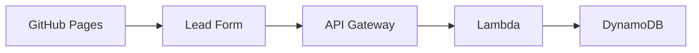
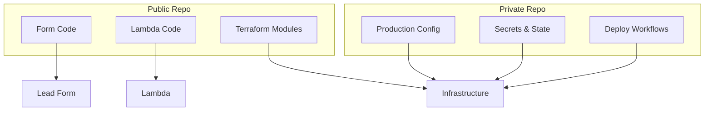

# Design Document

## Overview

The serverless lead capture system consists of three main components: a client-side embeddable form, a serverless AWS backend API, and infrastructure provisioned via Terraform. The architecture prioritizes security, scalability, and future Mautic integration while maintaining separation between public development code and private production configurations.

## Architecture

### High-Level Architecture

**Runtime Flow:**


**Repository Structure:**


**Legend:**
- **B (Lead Form)**: The embedded JavaScript form component
- **D (Lambda)**: AWS Lambda functions that process form submissions

### Component Interaction Flow

1. **Form Submission**: User fills out embedded form on GitHub Pages
2. **API Request**: Form sends POST request to AWS API Gateway endpoint
3. **Processing**: Lambda function validates, sanitizes, and processes the data
4. **Storage**: Lead data is stored in DynamoDB with encryption
5. **Notification**: Optional email notification sent via SES
6. **Response**: Success/error response returned to form

## Components and Interfaces

### 1. Embeddable Lead Form (Client-Side)

**Technology**: Vanilla JavaScript with CSS
**Location**: Public repository

**Key Features**:
- Lightweight, dependency-free implementation
- Responsive design that adapts to host website styling
- Real-time form validation
- CSRF protection via API key validation
- Customizable fields and styling options

**Interface**:
```javascript
// Embed code example
<script src="https://cdn.example.com/lead-capture.js"></script>
<div id="lead-capture-form" 
     data-api-endpoint="https://api.example.com/leads"
     data-api-key="public-key"
     data-fields="name,email,company">
</div>
```

### 2. Serverless API Backend

**Technology**: AWS Lambda (Node.js), API Gateway, DynamoDB
**Location**: Public repository (code), Private repository (config)

**Lambda Function Responsibilities**:
- Input validation and sanitization
- Rate limiting and spam protection
- Data transformation for Mautic compatibility
- Secure storage operations
- Error handling and logging

**API Endpoints**:
- `POST /leads` - Submit new lead data
- `GET /leads` - Retrieve leads (authenticated, for future Mautic sync)
- `POST /webhook` - Webhook endpoint for future integrations

### 3. Infrastructure as Code

**Technology**: Terraform
**Location**: Private repository

**AWS Services Provisioned**:
- **API Gateway**: RESTful API with CORS configuration
- **Lambda Functions**: Serverless compute for form processing
- **DynamoDB**: NoSQL database for lead storage with encryption at rest
- **IAM Roles**: Least-privilege access policies
- **CloudWatch**: Logging and monitoring
- **SES**: Email notifications (optional)
- **Route 53**: Custom domain management (optional)

## Data Models

### Lead Data Structure

```json
{
  "leadId": "uuid-v4",
  "timestamp": "2025-10-20T10:30:00Z",
  "source": "github-pages-site.com",
  "contact": {
    "name": "John Doe",
    "email": "john@example.com",
    "company": "Example Corp",
    "phone": "+1234567890"
  },
  "customFields": {
    "needs": "product-demo",
    "budget": "10k-50k"
  },
  "metadata": {
    "userAgent": "Mozilla/5.0...",
    "ipAddress": "192.168.1.1",
    "referrer": "https://google.com"
  }
}
```

### DynamoDB Table Schema

- **Primary Key**: `leadId` (String)
- **Sort Key**: `timestamp` (String, ISO format)
- **Global Secondary Index**: `email` for deduplication
- **Attributes**: All lead data as nested JSON
- **TTL**: Optional expiration for GDPR compliance

## Error Handling

### Client-Side Error Handling

- Network connectivity issues
- API rate limiting responses
- Validation errors
- Timeout handling (10-second limit)

### Server-Side Error Handling

- Input validation failures (400 Bad Request)
- Rate limiting exceeded (429 Too Many Requests)
- Database connection issues (500 Internal Server Error)
- Authentication failures (401 Unauthorized)

### Error Response Format

```json
{
  "success": false,
  "error": {
    "code": "VALIDATION_ERROR",
    "message": "Email address is required",
    "field": "email"
  }
}
```

## Security Considerations

### Data Protection

- All data encrypted in transit (HTTPS/TLS 1.2+)
- DynamoDB encryption at rest using AWS KMS
- Input sanitization to prevent XSS and injection attacks
- Email validation to prevent spam submissions

### Access Control

- API Gateway with API key authentication
- CORS policies restricting allowed origins
- Lambda execution roles with minimal required permissions
- VPC configuration for database access (if needed)

### Privacy Compliance

- Data retention policies configurable via Terraform
- GDPR-compliant data handling procedures
- Audit logging for all data access
- Optional data anonymization features

## Repository Structure and Code/Config Separation

### Public Repository (`serverless-lead-capture`) - Development Code

**Contains**: Source code, reusable modules, documentation, examples
**Does NOT contain**: Secrets, production URLs, AWS credentials, state files

```
├── src/
│   ├── client/
│   │   ├── lead-capture.js          # Form JavaScript (references placeholder API)
│   │   ├── lead-capture.css         # Form styling
│   │   └── embed-example.html       # Integration example
│   ├── lambda/
│   │   ├── handlers/
│   │   │   ├── submit-lead.js       # Lambda function code
│   │   │   └── get-leads.js         # API endpoint handlers
│   │   ├── utils/
│   │   │   ├── validation.js        # Input validation logic
│   │   │   └── database.js          # DynamoDB operations
│   │   └── tests/                   # Unit and integration tests
│   └── terraform/
│       ├── modules/
│       │   ├── api-gateway/         # Reusable API Gateway module
│       │   ├── lambda/              # Lambda deployment module
│       │   ├── dynamodb/            # Database module
│       │   └── ses/                 # Email service module
│       └── examples/
│           └── basic-setup/         # Example Terraform usage
├── docs/
│   ├── deployment.md                # Deployment instructions
│   └── integration.md               # Form integration guide
├── README.md
└── package.json
```

### Private Repository (`serverless-lead-capture-prod`) - Production Configuration

**Contains**: Environment-specific configs, secrets, state, deployment workflows
**References**: Public repo modules via Git submodules or package references

```
├── terraform/
│   ├── environments/
│   │   ├── dev/
│   │   │   ├── main.tf              # Uses modules from public repo
│   │   │   ├── terraform.tfvars     # Dev-specific variables
│   │   │   └── backend.tf           # Dev state configuration
│   │   └── prod/
│   │       ├── main.tf              # Production infrastructure
│   │       ├── terraform.tfvars     # Production variables (encrypted)
│   │       └── backend.tf           # Production state configuration
│   └── shared/
│       ├── iam-roles.tf             # Cross-environment IAM
│       └── route53.tf               # Domain management
├── .github/
│   └── workflows/
│       ├── deploy-dev.yml           # Development deployment
│       ├── deploy-prod.yml          # Production deployment
│       └── destroy-dev.yml          # Environment cleanup
├── config/
│   ├── dev.tfvars                   # Development variables
│   ├── prod.tfvars.encrypted        # Encrypted production variables
│   └── secrets.tf                   # Secret management
└── scripts/
    ├── setup-aws-profile.sh         # AWS configuration helper
    └── encrypt-secrets.sh           # Secret encryption utility
```

### Code vs Configuration Breakdown

| Component | Public Repo (Code) | Private Repo (Config) |
|-----------|-------------------|----------------------|
| **JavaScript Form** | ✅ Source code with placeholder API URLs | ✅ Actual API endpoints in deployment configs |
| **Lambda Functions** | ✅ All handler code and business logic | ✅ Environment variables, memory/timeout settings |
| **API Gateway** | ✅ Terraform module for gateway setup | ✅ Domain names, SSL certificates, CORS origins |
| **DynamoDB** | ✅ Table schema and access patterns | ✅ Encryption keys, backup policies, capacity settings |
| **SES** | ✅ Email template code and sending logic | ✅ Verified domains, SMTP credentials, sender addresses |
| **Terraform** | ✅ Reusable modules and examples | ✅ State backends, provider configs, variable values |

## Testing Strategy

### Unit Testing

- Lambda function logic testing with Jest
- Input validation and sanitization tests
- Error handling scenario coverage
- Mock AWS service interactions

### Integration Testing

- End-to-end form submission workflows
- API Gateway and Lambda integration
- DynamoDB read/write operations
- Cross-browser compatibility testing

### Security Testing

- Penetration testing for common vulnerabilities
- Rate limiting effectiveness validation
- CORS policy verification
- Input sanitization validation

### Performance Testing

- Load testing with various submission volumes
- Lambda cold start optimization
- API response time monitoring
- Database query performance analysis

## Deployment Strategy

### Development Environment

- Terraform workspace for isolated testing
- Separate AWS account or resource prefixes
- Automated deployment via GitHub Actions
- Integration with development domain

### Production Environment

- Blue-green deployment strategy
- Automated rollback capabilities
- Health checks and monitoring
- Custom domain with SSL certificate

## Future Mautic Integration Points

### Data Compatibility

- Lead data structure aligned with Mautic contact fields
- Custom field mapping configuration
- Bulk export functionality for initial migration

### Real-time Integration

- Webhook endpoints for immediate lead forwarding
- API authentication for Mautic communication
- Retry logic for failed webhook deliveries

### Synchronization Features

- Bidirectional sync capabilities
- Conflict resolution strategies
- Incremental update support